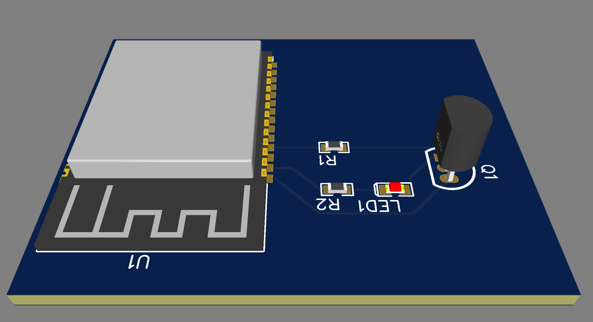

# 📻 Panasonic SC-HC37 IoT Gateway (ESP32 / Google Home)

Ce projet consiste en la création d'une passerelle IoT connectée permettant de moderniser une chaîne Hi-Fi classique **Panasonic SC-HC37** (et sa télécommande d'origine **N2QAYB000522**) afin de l'intégrer entièrement à l'écosystème domotique **Google Home**. 

Grâce à un microcontrôleur **ESP32**, le système interprète les commandes vocales de l'Assistant Google pour exécuter des scénarios matériels (macros) automatisés via l'émission de signaux infrarouges (IR) personnalisés.

---

## 🚀 Fonctionnalités
* **Contrôle Vocal Google Assistant :** Allumage, extinction et lancement de playlists ou de pistes spécifiques.
* **Macros d'automatisation embarquées :** Enchaînement de commandes matérielles complexes en gérant les temps de latence et les cycles de démarrage physiques du lecteur CD (ex: *Allumage -> Attente boot -> Passage en mode CD -> Lancement du Titre 7*).
* **Rétro-ingénierie du protocole IR :** Analyse brute des trames Panasonic 48-bits propriétaires avec contrôle d'intégrité de fin (XOR Checksum).
* **Amplification de puissance :** Circuit de commutation matériel dédié pour maximiser la portée de la diode émettrice infrarouge.

---

## 🛠️ Architecture Matérielle (Hardware)

Le montage initial sur breadboard a été converti en un circuit permanent sur plaque de prototypage perforée (**Perfboard**). 

Pour compenser le faible courant de sortie des broches GPIO de l'ESP32 (3.3V) et obtenir une portée infrarouge maximale, un **transistor NPN 2N2222** est configuré en mode de commutation (switch) pour piloter la LED IR.

### Liste des composants (BOM)
* 1x Microcontrôleur **ESP32** (30 broches)
* 1x Transistor NPN **2N2222** (Boîtier TO-92)
* 1x Diode émettrice **Infrarouge (IR)**
* 1x Résistance de protection de la Base ($R_1$) : **330 Ω** *(Orange-Orange-Marron)*
* 1x Résistance de puissance de la LED ($R_2$) : **100 Ω** *(Marron-Noir-Marron)*
* 1x Plaque de prototypage perforée (**Perfboard**) 50x70mm

### Schéma de Câblage & Rendu 3D (EasyEDA)

| Composant de départ | Broche / Patte | Composant d'arrivée | Broche / Patte | Rôle |
| :--- | :--- | :--- | :--- | :--- |
| **ESP32** | `GPIO 4` | **Résistance 330 Ω** | Côté A | Signal de commande |
| **Résistance 330 Ω** | Côté B | **Transistor 2N2222** | `Base (B - Milieu)` | Protection de la puce |
| **ESP32** | `GND` | **Transistor 2N2222** | `Émetteur (E - Gauche)`| Masse commune |
| **Transistor 2N2222**| `Collecteur (C - Droite)` | **LED IR** | `Cathode (- / Courte)` | Ligne commutée |
| **LED IR** | `Anode (+ / Longue)` | **Résistance 100 Ω** | Côté A | Ligne d'anode |
| **Résistance 100 Ω** | Côté B | **ESP32** | `3V3` | Alimentation |

*(Astuce de fabrication : Dans le dossier `/hardware`, les pistes bleues représentent les ponts de soudure à l'étain sous la carte, et les pistes rouges représentent les câbles de pontage sur le dessus).*

 ---

## 💻 Architecture Logicielle (Software)

Le micrologiciel est développé en **C++** avec **PlatformIO** (Framework Arduino). 

### Dépendances clés :
* `SinricPro` : Gestion du protocole WebSocket et liaison sécurisée Cloud-to-Device avec l'écosystème Google Home.
* `IRremoteESP8266` : Gestion bas niveau des timings et de la modulation de l'émetteur IR à 38 kHz.

### Analyse du protocole Infrarouge (Reverse Engineering)
Le décodage de la télécommande d'origine a mis en évidence le protocole Panasonic 48-bits (Adresse: `0x4004`). La structure des trames obéit à une logique stricte où le 4ème octet sert de Checksum de sécurité calculé par un OU exclusif ($\oplus$) des trois premiers octets :

$$\text{Octet}_1 \oplus \text{Octet}_2 \oplus \text{Octet}_3 = \text{Checksum}$$

* **Power (Allumage) :** `0x40040538BC81` ($0x05 \oplus 0x38 \oplus 0xBC = 0x81$)
* **Mode CD :** `0x400405505005` ($0x05 \oplus 0x50 \oplus 0x50 = 0x05$)
* **Titre 7 :** `0x400405386855` ($0x05 \oplus 0x38 \oplus 0x68 = 0x55$)

### Implémentation de la Macro d'allumage
Lors de la réception de la commande Google Home, la machine à états de l'ESP32 orchestre précisément les délais nécessaires aux composants électromécaniques de la chaîne Hi-Fi pour s'initialiser :

```cpp
if (state) { // Commande Google "Allumer"
    irsend.sendPanasonic(0x4004, 0x0538BC81);  // 1. Envoi Power
    delay(5000);                               // 2. Attente de l'initialisation (5s)
    irsend.sendPanasonic(0x4004, 0x05505005);  // 3. Passage en mode CD
    delay(6000);                               // 4. Attente du spin du disque (6s)
    irsend.sendPanasonic(0x4004, 0x05386855);  // 5. Sélection de la piste (Titre 7)
}

## 🔧 Installation et Configuration

### 🔐 Sécurisation des identifiants
> ⚠️ **Important :** Ne publiez jamais vos clés API et vos identifiants Wi-Fi personnels sur GitHub. 

Avant de pousser votre code, assurez-vous de masquer vos accès. La meilleure pratique consiste à utiliser un fichier de configuration séparé (ex: `include/secrets.h`) ou à modifier les lignes suivantes dans votre `main.cpp` avec des balises génériques :

```cpp
#define WIFI_SSID   "VOTRE_SSID"
#define WIFI_PASS   "VOTRE_MOT_DE_PASSE"
#define APP_KEY     "VOTRE_SINRIC_APP_KEY"
#define APP_SECRET  "VOTRE_SINRIC_APP_SECRET"
#define SWITCH_ID   "VOTRE_SINRIC_DEVICE_ID"
